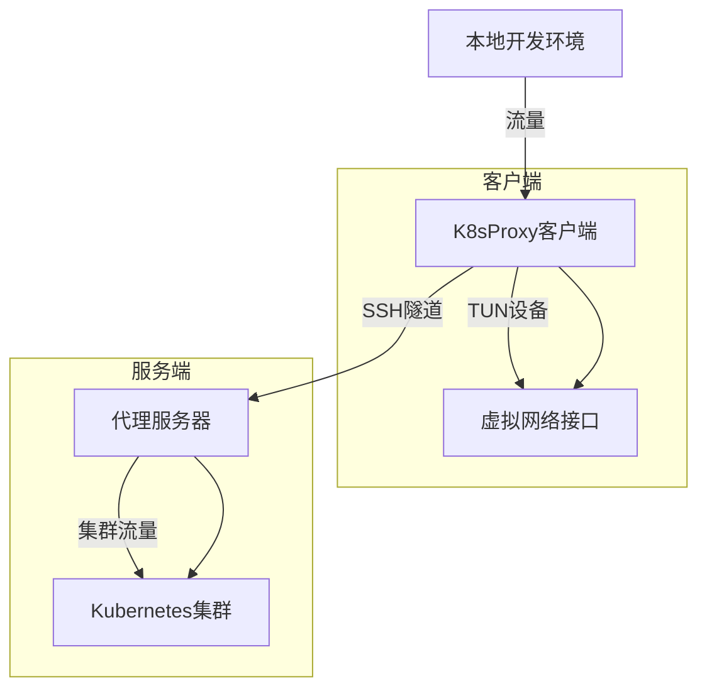

# K8sProxy - Kubernetes本地开发网络穿透工具

[](https://goreportcard.com/report/github.com/yourname/k8sproxy)


K8sProxy 是一个用于打通本地开发环境与 Kubernetes 集群网络的代理工具。通过创建虚拟网络接口和智能路由规则，实现本地IDEA启动的程序可以直接与Kubernetes集群中的微服务通讯，方便代码开发和调试。

## 核心功能

- **自动创建虚拟网络接口**：在本地创建虚拟网络接口，用于与Kubernetes集群中的Pod进行通信。
- **智能路由Kubernetes CIDR流量**：自动将Kubernetes集群的CIDR流量路由到虚拟网络接口。
- **多平台支持**：支持Windows、macOS和Linux系统。
- **SSH隧道代理**：通过SSH隧道将本地流量转发到Kubernetes集群中的Pod。
- **客户端-服务器架构**：客户端负责本地网络配置，服务器负责管理客户端信息和路由规则。

## 技术架构


## 快速开始

### 服务端部署（Linux）
```bash
# 构建服务端二进制
cd build && ./build.sh -s

# 配置示例（修改cmd/server/main.go中的默认配置）
echo '{ 
"proxy": { "sshHost": "your.ssh.host", "sshUser": "root", "sshPwd": "your_password" }, "routes": ["10.233.64.0/18", "10.233.0.0/18"] }' > config.json

# 启动服务
./dist/server
```

### 客户端部署
```bash
# 构建对应平台版本
build/build.sh -w # Windows
build/build.sh -m # macOS

# 运行客户端（需管理员权限）
sudo ./dist/k8sproxy # macOS/Linux
./dist/k8sproxy.exe # Windows
```

## 未来演进路线

- **支持多平台**：扩展支持更多的操作系统和架构。
- **增强安全性**：增加对SSH密钥认证的支持，提升安全性。
- **优化性能**：进一步优化网络传输性能，减少延迟。
- **支持多集群**：支持同时连接多个Kubernetes集群。
- **图形化界面**：提供图形化界面，方便用户配置和管理。

## 贡献指南

我们欢迎任何形式的贡献，包括但不限于：
- 提交问题和建议
- 提交代码改进
- 编写文档

请阅读贡献指南了解如何参与贡献。

## 许可证

本项目采用 MIT 许可证。

## 致谢

- [wintun](https://www.wintun.net/) - Windows下的虚拟网络接口库
- [socks5](https://github.com/armon/go-socks5) - SOCKS5代理库
- [sshproxy](https://github.com/tg123/sshproxy) - SSH代理库
